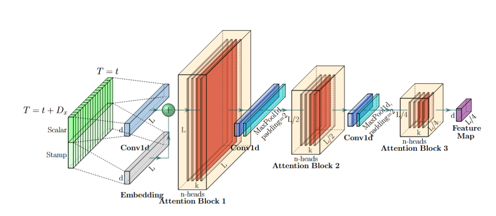

# INFORMER: Modelo de Pronóstico de Series Temporales

**INFORMER** es un modelo de pronóstico de series temporales de última generación que combina eficiencia y precisión en horizontes de predicción muy extensos. Su diseño está optimizado para procesar secuencias de cientos o incluso miles de pasos, reduciendo drásticamente el tiempo de entrenamiento y el consumo de memoria en comparación con los Transformers estándar.

## Características principales

-   **Atención ProbSparse**: Selecciona dinámicamente las consultas más relevantes, reduciendo la complejidad de $O(L^2)$ a $O(L \log L)$.
-   **Distilling progresivo**: Cada capa del encoder incluye un paso de compresión que elimina redundancias, reduce la dimensionalidad de la secuencia y estabiliza el entrenamiento.
-   **Arquitectura encoder-decoder**: Flujo bidireccional de información que combina datos históricos y contexto futuro.
-   **Decodificador generativo**: Predice la secuencia completa de una sola vez (*one forward step*), evitando la acumulación de errores y mejorando radicalmente la velocidad de inferencia.
-   **Versatilidad de dominios**: Validado en energía, tráfico, finanzas, ventas y meteorología.

## Arquitectura del modelo

La arquitectura de INFORMER está diseñada para resolver los tres grandes problemas de los Transformers en tareas de pronóstico a largo plazo (LSTF): la complejidad cuadrática de la atención, el alto consumo de memoria al apilar capas y la baja velocidad de inferencia en decodificación auto-regresiva.

### 1. Atención ProbSparse

El mecanismo de auto-atención canónico, con una complejidad de $O(L^2)$, es el principal cuello de botella computacional. La hipótesis de Informer es que la distribución de los scores de atención es dispersa (*sparse*), es decir, solo unas pocas parejas de "consulta-clave" (query-key) contribuyen significativamente al resultado.

Para cada consulta $q_n$, se evalúa su relevancia midiendo la divergencia entre su distribución de atención y una distribución uniforme mediante la métrica de *Query Sparsity*. Una aproximación eficiente de esta métrica es:

$$M(q_n, K) = \max_j \frac{q_n k_j^T}{\sqrt{d}} - \frac{1}{L_K} \sum_{j=1}^{L_K} \frac{q_n k_j^T}{\sqrt{d}}$$

Se construye un subconjunto $Q_{reduce}$ con las $u = c \cdot \ln L_Q$ consultas de mayor valor $M$. El mecanismo de atención solo se calcula para este subconjunto de consultas, reduciendo el coste a **$O(L \log L)$**. Por ejemplo, al predecir demanda energética, el modelo prioriza automáticamente las horas punta de consumo, ignorando los valles de baja actividad.

### 2. Encoder con Distilling

El encoder está diseñado para extraer dependencias robustas a larga distancia de secuencias de entrada muy largas.

-   **Encoder** ($e\_layers$ bloques): cada bloque ejecuta:
    1.  Multi-Head ProbSparse Self-Attention.
    2.  Operaciones esenciales como Layer Normalization y conexiones residuales.
    3.  **Self-Attention Distilling**: una operación de compresión que reduce la longitud de la secuencia de entrada para la siguiente capa.

El *distilling* se implementa con una convolución 1D seguida de una capa de Max-Pooling con *stride* 2, que reduce la secuencia a la mitad en cada capa. Esto no solo reduce el uso de memoria a $O((2-\epsilon)L \log L)$, sino que también permite enfocar las capas superiores en las características más dominantes.

### 3. Pila del encoder (Figura 3)

Para mejorar la robustez, el encoder utiliza una estructura piramidal donde se procesan réplicas de la misma entrada a diferentes escalas (por ejemplo, la secuencia completa, la mitad, un cuarto). Las salidas de todas las pilas se concatenan para formar la representación final del encoder.


*Figura 3: La pila principal del encoder recibe la secuencia completa. Los bloques de atención (rojo) procesan la secuencia. Después de cada bloque, la operación de "distilling" (Conv1d + MaxPool) reduce a la mitad la longitud de la secuencia. Se crean réplicas de esta pila que reciben secuencias más cortas para aumentar la robustez. Las salidas de todas las pilas se concatenan.*

### 4. Decoder Generativo

El decodificador de Informer está diseñado para generar secuencias largas en un solo paso, lo que mejora drásticamente la velocidad de inferencia.

-   **Input del Decoder**: Se alimenta con una concatenación de un segmento de la secuencia de entrada (el *start token*) y marcadores de posición (*placeholders*) para la secuencia objetivo a predecir.
    $$
    X_{de} = \text{Concat}(X_{token}, X_0)
    $$
-   **Decoder** ($d\_layers$ bloques): cada bloque incluye:
    1.  Multi-Head Attention sobre la salida comprimida del encoder.
    2.  Masked Multi-Head ProbSparse Self-Attention para procesar la entrada del decodificador de forma causal (evitando que una posición atienda a posiciones futuras).
    3.  Una capa *fully connected* final proyecta la representación a la dimensión de salida deseada.

Este diseño predice todos los puntos del horizonte de una sola vez, evitando la propagación de errores típica de los modelos auto-regresivos tradicionales.

## Instalación

1.  Clona el repositorio:
    ```bash
    git clone [https://github.com/tu_usuario/INFORMER.git](https://github.com/tu_usuario/INFORMER.git)
    cd INFORMER
    ```
2.  (Opcional) Crea y activa un entorno virtual:
    ```bash
    python -m venv venv
    # Windows
    venv\Scripts\activate
    # macOS/Linux
    source venv/bin/activate
    ```
3.  Instala dependencias:
    ```bash
    pip install --upgrade pip
    pip install torch numpy pandas matplotlib pytest neuralforecast
    ```
4.  Verifica la instalación:
    ```bash
    python -c "import neuralforecast; print('NeuralForecast versión:', neuralforecast.__version__)"
    ```

## Uso

Ejemplo de entrenamiento e inferencia:

```python
import pandas as pd
from neuralforecast import NeuralForecast
from neuralforecast.models import Informer

# 1. Preparación de datos
data = pd.read_csv('data/serie.csv', parse_dates=['ds'])
data = data.sort_values(['unique_id', 'ds'])

# 2. Configuración del modelo
model = Informer(
    input_size=96,      # Longitud de la secuencia de entrada
    pred_len=24,      # Horizonte de predicción
    label_len=48,       # Longitud del start token para el decoder
    e_layers=3,         # Capas en el encoder
    d_layers=2,         # Capas en el decoder
    n_heads=4,          # Número de cabezales de atención
    d_model=256,        # Dimensión del modelo
    dropout=0.1,
    attn='prob',        # Usar ProbSparse Attention
    distil=True         # Activar el distilling en el encoder
)

# 3. Entrenamiento
nf = NeuralForecast(models=[model], freq='H') # Frecuencia horaria
nf.fit(df=data)

# 4. Predicción
forecast = nf.predict()
print(forecast.tail(10))